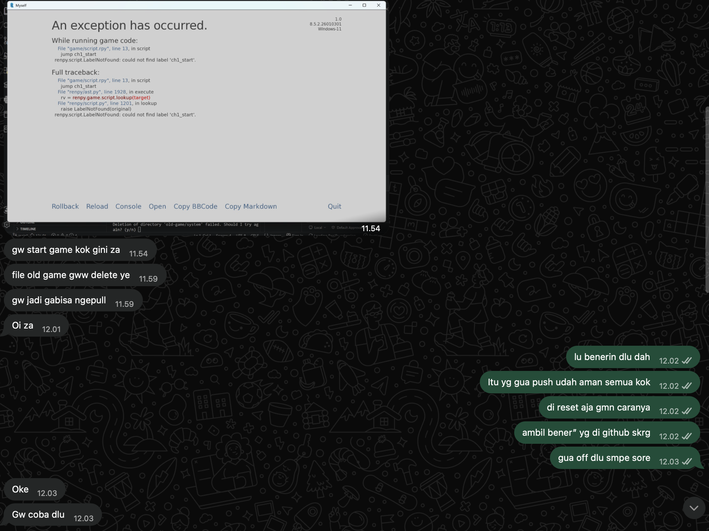

## Kompetensi target

Mengadaptasi repertoire dan language tanpa mengubah core meaning.

## Core meaning (Detoks Jargon)

**Konsep Teknis:** *Git Pull Conflict* dan Sinkronisasi Repositori.

**Definisi Teknis Awal:** "Proses *git pull* dari *remote branch* ditolak (*aborted*) karena terdapat perbedaan riwayat komit pada *local repository*. Untuk mengatasi *merge conflict* ini tanpa mempertahankan editan lokal, pengguna harus mengeksekusi `git fetch` dilanjutkan dengan `git reset --hard` untuk melakukan penimpaan (*overwrite*) secara utuh dari server."

**Daftar Jargon & Arti Sederhana:**
1. *Remote repository* $\rightarrow$ File utama proyek yang disimpan di cloud/internet (misal: GitHub).
2. *Merge conflict* $\rightarrow$ Bentrok data; sistem kebingungan waktu mau ngegabungin editan versi lama dan versi baru.
3. *Hard reset / overwrite* $\rightarrow$ Menghapus paksa file lokal yang error, lalu menggantinya 100% pakai versi terbaru dari server.

**Fakta yang tidak boleh berubah (Kebenaran Inti):**
Sistem gagal mengunduh pembaruan karena ada file di laptop kita yang bentrok. Solusinya, kita harus hapus file lokal yang bermasalah itu, lalu unduh ulang versi utuhnya dari server biar sistem jalan normal lagi.

| Target/character | Versi language | Alasan adaptasi |
|---|---|---|
| **Anak-anak (Usia 10)** | "Bayangin kamu lagi main susun lego, tapi tiba-tiba temanmu dari jauh ngubah bentuknya. Biar mainannya nggak hancur karena tabrakan, kamu singkirin dulu potongan lego yang salah di mejamu, terus minta kotak lego baru yang masih utuh dari temanmu." | Pakai analogi fisik (mainan lego) yang gampang dibayangin anak-anak, soalnya mereka belum paham konsep *file* digital atau *coding* yang nggak kelihatan bentuknya. |
| **Sahabat (Beda Jurusan)** | "Bro, file game di laptop lu tuh bentrok pas mau narik *update* terbaru dari gw. Biar ga pusing, lu hapus aja folder lamanya yang ada di laptop lu, terus *download* ulang semuanya dari awal pake link baru. Dijamin langsung aman." | Bahasanya super kasual (lu/gw), langsung ke *point action* yang harus dilakuin, dan ngebuang semua istilah pusing kayak *Git*, *pull*, atau *merge*. |
| **Technical peer** | "Lokal *branch* lu konflik tuh sama origin gara-gara beda *timeline*. Daripada ribet *resolve conflict* manual, mending lu ketik `git fetch --all` terus `git reset --hard origin/main`. Ntar *local state* lu otomatis ke-*overwrite* sama versi stabil yang baru gw *push*." | Pakai instruksi terminal (*command prompt*) yang presisi dan istilah asli *developer* karena target butuh akurasi dan udah paham konteks teknisnya. |
| **Manager** | "Pak, ada sedikit kendala sinkronisasi data di perangkat salah satu anggota yang bikin proses *testing* terhambat. Biar efisien, saya sarankan kita *force-sync* langsung dari server utama. Ini tidak memakan biaya dan *testing* bisa langsung jalan lagi dalam 5 menit." | Fokus ke efisiensi waktu, manajemen risiko, dan usulan penyelesaian masalah. Manajer nggak peduli soal *coding* errornya, yang penting masalahnya cepat beres. |
| **Customer / Public** | "Pembaruan gagal dipasang karena ada data lama di perangkat Anda yang tidak sinkron. Tidak perlu khawatir, silakan hapus aplikasi lamanya lalu unduh ulang versi terbarunya lewat tautan resmi kami supaya aplikasi berjalan lancar kembali." | Fokus ngasih instruksi pelayanan yang ramah, menenangkan *user*, dan ngasih tahu solusi yang gampang diikutin tanpa nyalahin penggunanya. |

## Evidence understanding & Artefak Real-Time

### 1. Bukti Visual Tangkapan Layar & Teks Mentah Chat

> **[17/05/26, 11:54:03] F:** *"gw start game kok gini za"*  
> **[17/05/26, 11:59:43] F:** *"file old game gww delete ye, gw jadi gabisa ngepull"*  
> **[17/05/26, 12:01:32] F:** *"Oi za"*  
> **[17/05/26, 12:02:27] Zha:** *"di reset aja gmn caranya, ambil bener” yg di github skrg"*  
> **[17/05/26, 12:03:44] F:** *"Gw coba dlu"*  
> **[17/05/26, 14:42:11] F:** *"udah gw testing za, aman sih"*  

### 2. Analisis Dinamika Adaptasi (Response & Adaptation)
* **Deteksi Sinyal Kebingungan Awal (Initial State Target):** Target F memberikan sinyal kebingungan dan kebuntuan teknis (*"gw start game kok gini za"*, *"gw jadi gabisa ngepull"*). F mengalami *merge conflict* akibat menghapus file lokal tanpa menyelaraskan *commit history*.
* **Adaptasi Bahasa Instan:** Mendengar sinyal kebingungan tersebut, saya menahan diri untuk tidak membeberkan jargon rumit (*git tree*, *conflict markers*, atau *rebase*). Saya langsung beradaptasi ke ragam bahasa instruksional kasual: *"di reset aja... ambil bener-bener yang di github sekarang"*.
* **Perubahan State & Resolusi:** Penyesuaian bahasa ini berhasil mengubah *state* target dari bingung/stuck menjadi paham tindakan yang harus diambil (*"Gw coba dlu"*). Target sukses mengeksekusi reset lokal dan menyelesaikan sesi *testing* game (*"udah gw testing za, aman sih"*).

## Analisis dan batas (Refleksi)

* **Ragam bahasa tersulit:** Bikin versi anak-anak tuh rasanya paling susah. Butuh mikir lumayan lama buat ngelepasin konsep digital kayak "baris kode" atau "server" jadi objek fisik (lego) tanpa bikin esensi pesannya melenceng.
* **Perubahan sudut pandang:** Dari tugas ini aku sadar, sebagai anak IT kadang aku terlalu mikir semua orang bakal paham istilah macam *pull*, *push*, atau *conflict*. Padahal di lapangan, ngasih instruksi praktis pakai bahasa sehari-hari ("hapus aja foldernya terus *download* lagi") itu jauh lebih nyelamatin nyawa dan waktu tim daripada maksa mereka belajar cara kerja sistemnya.
* **Batas Penggunaan AI:** `Tidak menggunakan AI` untuk *generate* teks terjemahan atau ide analogi. AI hanya dipakai bantu merapikan susunan tabel *markdown* biar *render* di Quartonya nggak berantakan.

## Self-assessment

| Dimensi | Skor | Evidence singkat |
|---|---:|---|
| Person & Character | 3 | Lima target audiens dibedain lewat *needs* dan *background* mereka, bukan cuma asal ganti gaya sapaan. |
| Objective & State | 4 | Fakta inti (*core meaning* buat mereset data) konsisten dibawa ke semua bahasa. |
| Repertoire, Language & AI | 4 | Sukses nerapin gaya bahasa analitis, instruksional, dan kasual di momen yang pas, lengkap sama batasan AI. |
| Response & Adaptation | 4 | Menangkap sinyal kebingungan target dan berhasil beradaptasi dengan instruksi bahasa yang memecahkan *stuck*. |
| Agreement, Action & Relationship | 3 | Krisis di kelompok kelar lewat pendekatan bahasa yang disesuaikan sama kapasitas *partner*. |

**Total: 18/20 — Kompeten.**

::: {.assessor-only}
### Assessment dosen

**Skor:** — / 20  
**Evidence yang mendukung:** —  
**Prioritas perbaikan:** —  
**Keputusan:** Belum dinilai / Perlu revisi / Tercapai
:::