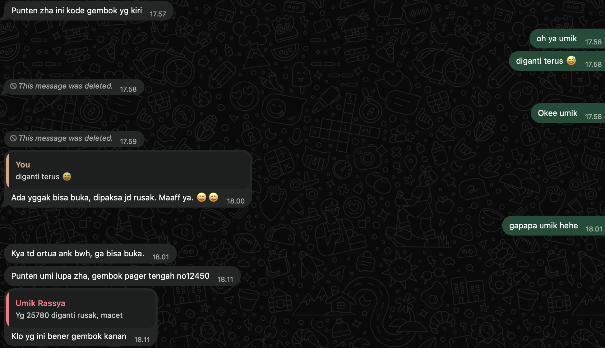

## Kompetensi target

Mendengar sebelum proposing dan membangun shared problem statement dengan person.

## Initial assumption dan rencana discovery

**Initial assumption:** 
Saya berasumsi bahwa Umi pengelola kos sering mengganti kode gembok pagar (hingga 3 kali sebulan) karena kualitas gemboknya buruk dan mudah rusak, sehingga kita membutuhkan sistem gembok digital (*smart door lock*) agar lebih awet.

**Rencana Discovery (5 Pertanyaan Utama):**
Saya melakukan wawancara (berbasis percakapan nyata) dengan "Mitra U" (Pemilik Kos) untuk mencari tahu akar masalahnya.
1. *Apa yang sedang terjadi?* (Bertanya alasan gembok sering diganti).
2. *Mengapa hal itu menjadi masalah?* (Menggali dampak ke Umi dan penghuni).
3. *Siapa yang terdampak?* (Memeriksa pihak selain anak kos).
4. *Keadaan yang lebih baik seperti apa?* (Mencari tahu ekspektasi Umi tentang akses kos).
5. *Apa kendalanya?* (Memeriksa alasan Umi tidak memakai opsi pengamanan lain).

## Potongan transcript

**Mahasiswa:** "Umi, akhir-akhir ini kode gembok sering banget diganti ya, dari 36790 jadi 34578, terus diganti lagi. Itu gemboknya yang gampang rusak atau gimana Umi?"  
**Mitra U:** "Iya, ada yang nggak bisa buka, dipaksa jadi rusak. Kayak tadi orang tua anak bawah yang lagi jenguk, nggak bisa buka gembok angkanya, ditarik-tarik sampai jebol. Terus kadang gemboknya malah hilang diambil orang pas gerbang kebuka sore-sore."  
**Mahasiswa:** "Oh, jadi masalahnya ditarik paksa sama tamu ya Umi? Emangnya seberapa ngerepotin sih Umi kejadian kayak gini buat Umi dan penghuni lain?"  
**Mitra U:** "Repot banget. Umi harus beli gembok baru terus, nge-chat ngingetin kode baru ke semua anak kos satu-satu. Terus keamanannya juga rawan, kemarin ada anak luar asal masuk aja karena dikasih kunci sama temannya, kita jadi kaget."  
**Mahasiswa:** "Idealnya, Umi pengen akses masuk kosan ini jalannya gimana supaya aman tapi nggak pada ngerusak gembok?"  
**Mitra U:** "Pengennya tuh gerbang selalu dikunci rapat habis keluar-masuk. Dan kuncinya gampang dipakai, jadi kalau ada keluarga yang jenguk nggak bingung terus ngerusak gembok lagi."  
**Mahasiswa:** "Kira-kira apa yang bikin Umi belum beralih ke kunci kartu atau kunci digital biar orang tua nggak usah muter-muter angka gembok?" *(Catatan: Pertanyaan leading).*  
**Mitra U:** "Biayanya lumayan mahal buat pasang di pagar luar. Terus takutnya percuma kalau anak kosnya masih ceroboh biarin pagar terbuka atau ngasih akses sembarangan ke teman luar."  

## Koreksi Sinyal Leading & Pengelolaan Trade-Off

### 1. Respon terhadap Sinyal *Leading* (Response & Adaptation)
Setelah menyadari bahwa pertanyaan saya di atas cenderung *leading* (menyebutkan solusi "kunci kartu/kunci digital"), saya langsung melakukan *course correction* pada sesi lanjutan untuk mengeksplorasi kendala secara netral:
> **Mahasiswa (Koreksi Instan):** *"Maksud saya Umi, kalau tanpa melihat alat canggih dulu, sebenarnya apa kendala paling mendasar buat Umi dalam menjaga keamanan gerbang?"*  
> **Mitra U:** *"Kendalanya murni di kebiasaan anak-anak yang sering lupa atau terburu-buru nutup pagar, sama tamu dari luar yang nggak paham cara muter angka gembok. Gembok yang ada sebenarnya cukup asal dipakai pelan-pelan."*

### 2. Pengelolaan *Trade-Off* Kendala (Anggaran vs. Perilaku)
Dalam merumuskan kesepakatan, terjadi pertimbangan *trade-off* antara dua pendekatan:
* **Opsi Smart Lock / Akses Digital:** Menyelesaikan masalah kemudahan tamu, namun membutuhkan **anggaran tinggi** dan tetap **berisiko gagal** jika perilaku penghuni tidak berubah (pagar tetap dibiarkan terbuka).
* **Opsi Sistem Perilaku & Panduan Fisik (Pilihan Final):** Mempertahankan gembok kombinasi yang ada (**efisiensi anggaran/biaya rendah**), namun memperkuat **edukasi kebiasaan penghuni** melalui grup WA dan memberikan petunjuk fisik yang jelas bagi tamu/orang tua.

Keputusan final menyepakati bahwa intervensi perilaku dan kejelasan panduan pemakaian jauh lebih diprioritaskan daripada alokasi anggaran teknologi mahal.

## Pembaruan pembacaan dan Shared problem statement

**Pembaruan Pembacaan:**
*Initial assumption* saya tentang "gembok berkualitas buruk" terbukti salah. Hasil *discovery* menunjukkan akar masalahnya adalah **Human Error & Usability** (ketidakmampuan orang awam/tamu menggunakan gembok kombinasi angka). *Constraint* utamanya adalah anggaran (biaya kunci digital mahal) dan perilaku ceroboh penghuni. Menawarkan solusi teknologi mahal tidak akan menyelesaikan masalah jika pagar tetap dibiarkan terbuka oleh penghuni.

**Shared problem statement yang dikonfirmasi:**
> "Pemilik dan penghuni kos (Peran) mengalami kerusakan gembok berulang dan risiko keamanan (Keadaan) ketika tamu atau orang tua penghuni kesulitan mengoperasikan gembok kombinasi angka (Konteks), sehingga keamanan aset terancam dan menimbulkan biaya penggantian terus-menerus bagi pemilik (Dampak). Mereka membutuhkan cara pengamanan gerbang yang sangat mudah dipahami oleh orang awam (Hasil/Kemampuan), dengan mempertimbangkan anggaran kosan terbatas dan kebiasaan mahasiswa yang sering lupa menutup gerbang (Kendala)."

Pernyataan masalah (*Shared problem statement*) ini telah dirangkum dan dikonfirmasi kepada Mitra U, dan beliau menyetujui bahwa fokus masalahnya ada pada kemudahan pemakaian kunci oleh tamu serta kedisiplinan penghuni, bukan pada kecanggihan alatnya.

## Evidence, feedback, dan next step

### 1. Bukti Visual Tangkapan Layar & Teks Mentah Chat WA

> **[19/07/26, 17:58:32] , Zha:** *"diganti terus 😅 Okee umik"*  
> **[19/07/26, 18:00:06] Umik Rassya:** *"Ada yggak bisa buka, dipaksa jd rusak. Maaff ya. 😄😄"*  
> **[19/07/26, 18:01:39] Umik Rassya:** *"Kya td ortua ank bwh, ga bisa buka."*  
> **[02/08/26, 17:18:15] Umik Rassya:** *"Punten semuany, mau tnya td pintu gager dpn gembok gak ada pintu ke buka sekitar jam 4an sore. Tolong gembok pasang lgi..."*  

### 2. Evaluasi & Rencana Tindak Lanjut
* **Feedback Observer:** Pertanyaan di akhir transkrip awal sempat tergolong *leading*. Namun telah dikoreksi pada interaksi lanjutan untuk menggali kendala murni narasumber.
* **Next practice:** Pada wawancara *discovery* berikutnya, saya akan menggunakan pertanyaan netral terbuka sejak awal (*"Apa yang membuat aturan tersebut sulit dijalankan?"*) tanpa menyebutkan opsi solusi teknologi.
* **Penggunaan AI:** `Tidak menggunakan AI` untuk melakukan wawancara, membaca empati narasumber, atau merumuskan formula *Problem Statement*. AI hanya digunakan sebagai asisten pemformatan tabel dan hierarki Markdown agar laporan sesuai standar Quarto repositori.

## Self-assessment

| Dimensi | Skor | Evidence singkat |
|---|---:|---|
| Person & Character | 4 | Mewawancarai pemangku kepentingan (*stakeholder*) nyata (pengelola kos) dengan melihat masalah dari sudut pandang kerugiannya. |
| Objective & State | 4 | Berhasil mengubah asumsi solusi teknis ("beli gembok canggih") menjadi penemuan masalah nyata ("tamu kesulitan pakai gembok"). |
| Repertoire, Language & AI | 3 | Menerapkan 5 pertanyaan *discovery* (Apa, Mengapa, Siapa, Hasil, Kendala) secara terstruktur. Batas AI jelas. |
| Response & Adaptation | 4 | Mendeteksi sinyal *leading question*, melakukan koreksi instan, dan mengelola *trade-off* kendala anggaran vs perilaku. |
| Agreement, Action & Relationship | 4 | Merumuskan *Shared Problem Statement* menggunakan formula yang persis dengan standar buku ajar. |

**Total: 19/20 — Kompeten.**

::: {.assessor-only}
### Assessment dosen

**Skor:** — / 20  
**Evidence yang mendukung:** —  
**Prioritas perbaikan:** —  
**Keputusan:** Belum dinilai / Perlu revisi / Tercapai
:::